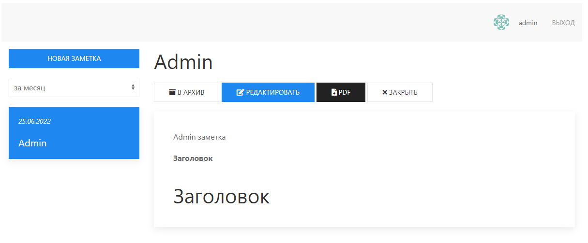

# Приложение заметок.


___
### Стек: 
- Backend: Node.js, 
- Front: Svelte
- Database: Mongo
- Сборка: Rollup.js

### Функционал:
- Регистрация, авторизация пользователя
- Создание персональных заметок
- Редактирование заметок
- Добавление заметок в архив
- Выгрузка заметки в PDF формате
- Удаление заметки

### Собрать фронт:
```
npm run build
```

### Запустить приложение:
```
npm start
```

### Запустить фронт в dev-режиме:
```
npm run dev-client
```

### Запустить сервер в dev-режиме:
```
nodemon index.js
```
